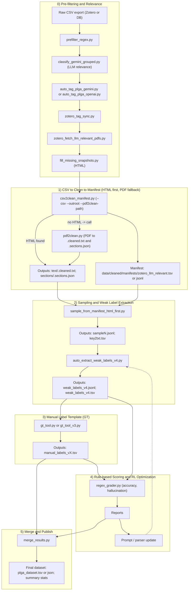

# RL-Agent-Extraction-PLGANPs
This project is an automated reinforcement learning-based prompt engineering workflow.

It's designed as a closed-loop system to automatically evaluate and optimize the performance of a Large Language Model (LLM). The core of the project is a Rule-based Grader that accurately calculates key metrics like extraction accuracy and hallucination rates based on pre-annotated data.

This workflow provides a scalable framework not just for validating initial prompts but also for continuously improving them through an iterative process. The ultimate goal is to boost the LLM's performance on specific tasks, such as extracting structured information from unstructured documents like PDFs and HTML files.

The key value of this project is that it transforms prompt engineering from a manual, trial-and-error process into a systematic, data-driven, and automated workflow, significantly improving development efficiency and model performance.

